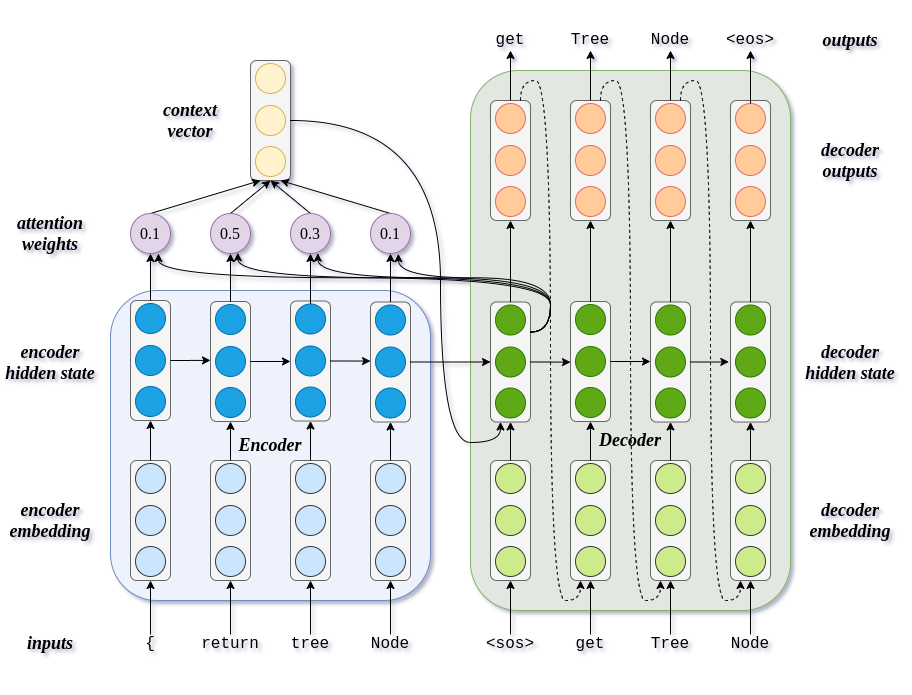
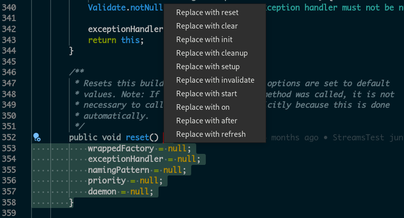
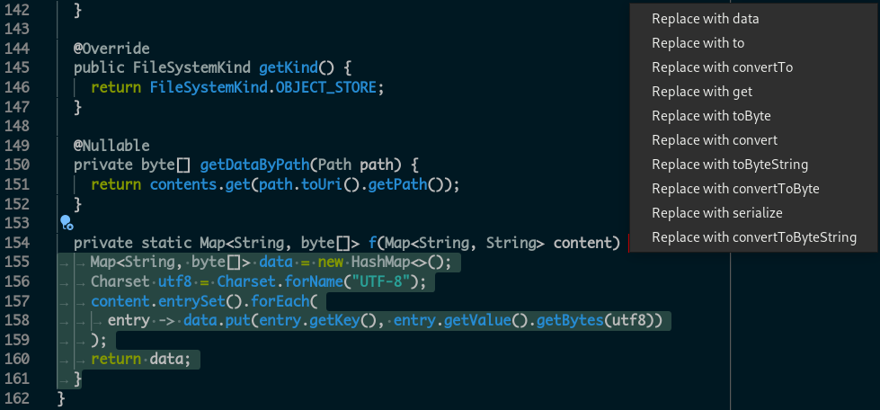

# Identifier Suggestion

Models for source code identifier suggestion built by learning from Big Code.

## Architecture



## VSCode Extension Demo





## Setup

### Requirements

1. Have Python 3.7 or above installed.

2. Have a Unix-like terminal with `bash`, `coreutils` and some other utilities like `wget` (required by some .sh scripts).

### Installation

1. Run `pip install -r requirements/dev.txt` to install all Python package dependencies.

### Installation with a virtual environment

For example, you can use the standard `venv`:

1. Run `python3 -m venv .venv` to create a virtual environment.

1. Run `source .venv/bin/activate` to activate the virtual environment. This step must be executed on every new terminal session.

1. Run `pip install -r requirements/dev.txt` to install all Python package dependencies.

### Training the model

1. Run `./src/scripts/baseline/train.sh` from this directory with all necessary packages pre-installed.

### Serving the model

1. Run `./src/scripts/baseline/serve.sh` from this directory with all necessary packages pre-installed.

## Project Structure

Follows the [Cookiecutter Data Science project structure](https://drivendata.github.io/cookiecutter-data-science/).

```text
├── LICENSE
├── README.md          <- The top-level README for developers using this project.
├── data
│   ├── external       <- Data from third party sources.
│   ├── interim        <- Intermediate data that has been transformed.
│   ├── meta           <- Data about the data.
│   ├── processed      <- The final, canonical data sets for modeling.
│   └── raw            <- The original, immutable data dump.
│
├── experiments        <- Generated JSON files with hyperparameters for random search
│
├── models             <- Trained and serialized models, model predictions, or model summaries
│
├── notebooks          <- Jupyter notebooks. Naming convention is a number (for ordering),
│                         the creator's initials, and a short `-` delimited description, e.g.
│                         `1.0-jqp-initial-data-exploration`.
│
├── reports            <- Generated analysis as HTML, PDF, LaTeX, etc.
│   └── thesis         <- Generated graphics and tables used in the thesis document
│
├── requirements       <- The requirements files for reproducing this environment.
│
├── src                <- Source code of the project.
│   ├── common         <- Module with common values and procedures
│   ├── data           <- Scripts for Java method name parsing and data preprocessing
│   ├── evaluation     <- Logic for evaluating model performance
│   ├── metrics        <- Metrics for evaluation of models
│   ├── models         <- Scripts to train models and then use trained models to make predictions
│   ├── pipelines      <- Training pipelines
│   ├── preprocessing  <- Data preprocessing logic
│   ├── scripts        <- Scripts for running model training or serving
│   ├── server         <- Model server
│   ├── utils          <- Utility functions
│   └── visualization  <- Scripts to create exploratory and results oriented visualizations
│
└── vscode-extension   <- Extension for VSCode
```
